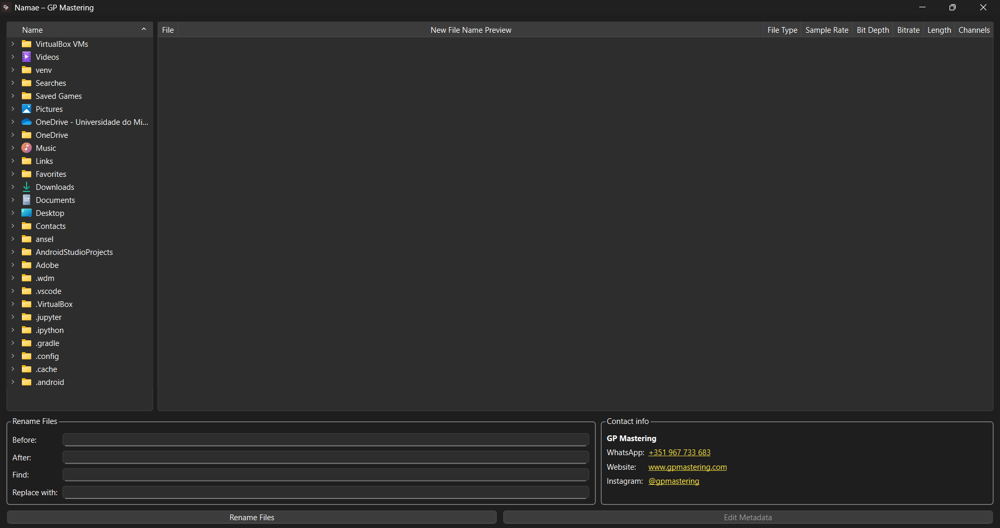
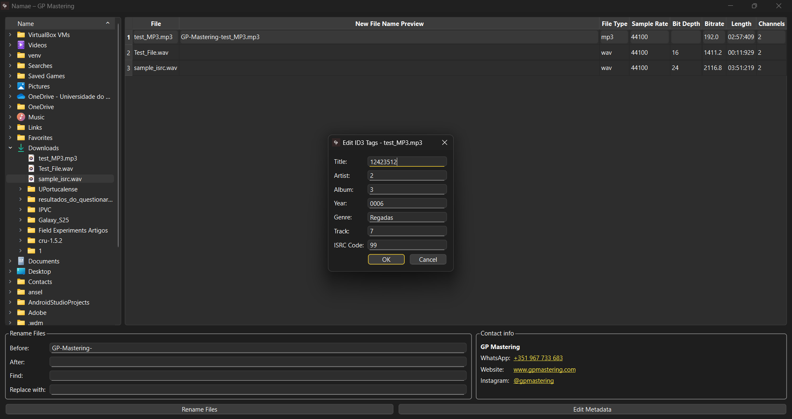
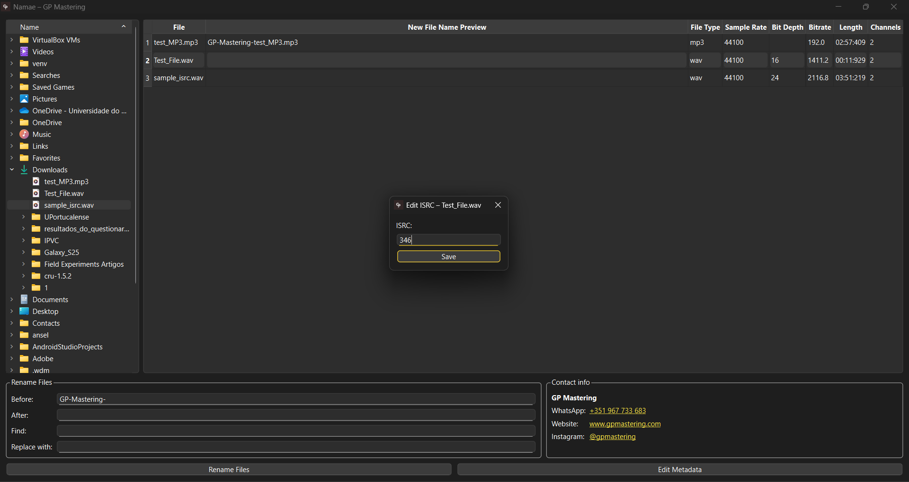
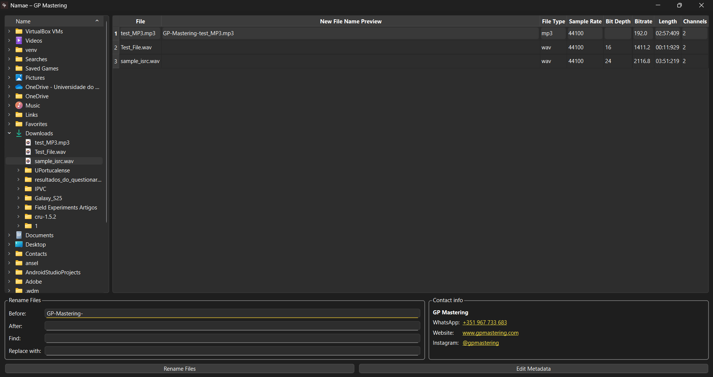

# Audio Bulk Renamer 🎵

> ⚠️ This repository contains only the source code and does **not** distribute any compiled version of the final product. The project was developed by me as part of a professional collaboration and is shared here strictly for portfolio purposes.

---

**Audio Bulk Renamer** is a cross-platform desktop application designed for **batch renaming audio files** with full metadata inspection and editing capabilities. Built with `PySide6`, it is tailored for **sound engineers**, **musicians**, and **audio professionals** who require a fast, reliable, and visually refined tool to organize and prepare their audio assets.

---

## 🎯 Features

- ✅ **Drag-and-drop interface** for `.wav` and `.mp3` files (supports dropping anywhere on the table area)
- ✅ **Flexible file selection**:
  - Click, Shift+Click, or Ctrl+Click to select multiple files  
  - Drag over empty table space to create a selection rectangle
- ✅ **Batch filename editing**:
  - Add prefix, suffix, or replace text
  - Apply changes to multiple files at once
- ✅ **Detailed audio metadata preview**:
  - **General**: Format, Duration, Channels  
  - **WAV-specific**: Sample Rate, Bit Depth (via `tinytag` / `ffprobe`)  
  - **MP3-specific**: Bitrate, Sample Rate, ID3 tags  
- ✅ **ID3 tag editing for `.mp3`**:
  - Title, Artist, Album, Genre, Year, Track, ISRC (via `mutagen`)
- ✅ **BWF metadata editing for `.wav`**:
  - ISRC reading/writing via `BWFMetaEdit`  
  - Audio analysis powered by `ffprobe` (via FFmpeg)
- ✅ **Cross-platform support**:
  - Windows (`.exe` with embedded `ffprobe` and `BWFMetaEdit`)
  - macOS (`.app` bundle with native binaries and Homebrew-installed dependencies)

---

## 🖥️ Tech Stack

- Python 3.x
- [PySide6](https://doc.qt.io/qtforpython/) – GUI framework
- [mutagen](https://mutagen.readthedocs.io/) – ID3 tag editing
- [tinytag](https://github.com/devsnd/tinytag) – Audio property reading
- [`ffprobe`](https://ffmpeg.org/ffprobe.html) – Metadata extraction for WAV files
- [`BWFMetaEdit`](https://mediaarea.net/BWFMetaEdit) – Broadcast Wave Format metadata editing

---

## 🚫 What's not included

To respect the commercial scope of the project and protect client interests, the following are **excluded**:

- ❌ Any compiled executables (`.exe`, `.app`, `.dmg`, `.pkg`)
- ❌ Commercial icons, branding, or proprietary UI assets
- ❌ Distribution-ready installers or build scripts for deployment

---

## 🧑‍💻 Author & Credits

This application was designed and built by **me** as part of a commissioned collaboration for a client in the audio industry, **GP Mastering**. The public version is intended as a **technical portfolio sample only**.

---

## 🎧 Contact for Commercial Use

**GP Mastering – Audio Mastering Services**  
📍 Portugal  
🌐 [www.gpmastering.com](http://www.gpmastering.com)  
📩 [info@gpmastering.com](mailto:info@gpmastering.com)  
📱 [WhatsApp / Phone](https://wa.me/351967733683): +351 967 733 683  
📸 [Instagram – @gpmastering](https://instagram.com/gpmastering)

> For inquiries about licensing, branded versions, or commercial distribution of the software, please contact GP Mastering directly.

---

## 📎 Legal & License

This source code is provided under the MIT License, limited to this repository version.

> **Do not** use this codebase for redistribution or commercial purposes without explicit permission from the original author.

---

## 📸 Screenshots

### 📂 Main Window

### ✏️ MP3 Edit Metadata

### 🎙️ WAV Edit Metadata

### 🖊️ Main Window Editing

---

## 📌 Roadmap (optional)

- [ ] Export metadata to CSV
- [ ] Support for FLAC and AIFF files
- [ ] Batch ISRC editing for WAV and MP3
- [ ] File renaming presets and configuration saving
- [ ] Drag-and-drop reordering in the file table
